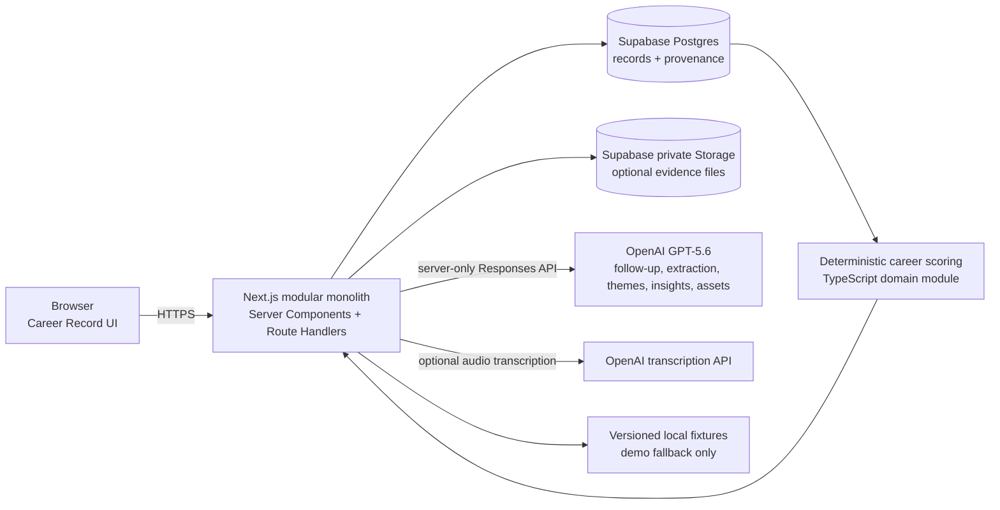
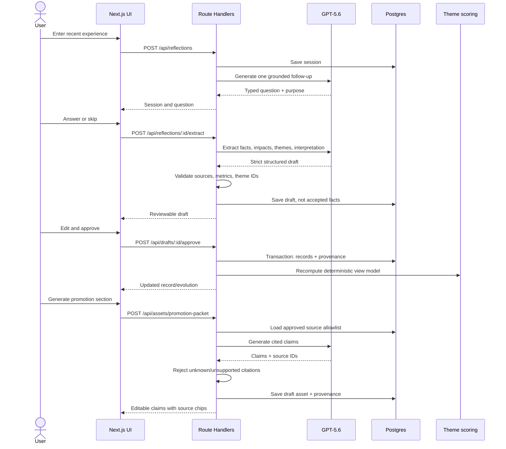

# Career Thread MVP Technical Design

**Status:** Approved for implementation planning  
**Date:** July 18, 2026  
**Target demo:** July 21, 2026  
**Track:** Apps for Your Life (recommended)  

## 1. Executive Summary

Career Thread should be a single Next.js TypeScript application deployed to Vercel, backed by Supabase Postgres and private object storage, with narrowly scoped server-side calls to the OpenAI Responses API. It is a modular monolith: one repository, one deployable application, one database, no queues, agents, vector store, or separate services.

The home screen is the Career Record, not a chat. A reflection is temporary input that produces a reviewable draft. Only after the user approves it are separate Experience, Evidence, Impact, Theme relationship, and Insight records committed. AI proposes follow-up questions, classifications, interpretations, and promotion prose; application code validates the shapes, records provenance, and computes Career Evolution deterministically. AI output never silently becomes accepted fact.

The build is designed backward from one sub-three-minute submission video: open a seeded Career Record, add one text reflection, answer one useful follow-up, review the extracted record, approve it, see Career Evolution change, and generate a promotion-packet section whose claims open the supporting experiences and evidence. Voice is progressive enhancement via browser recording and server transcription; text is always available.

This proves the thesis without pretending to build a mature career platform. Seeded history makes evolution visible; the newly entered experience, review, scoring update, and generated asset are real. A clearly labeled demo-safe mode may substitute prevalidated AI fixtures when the model is unavailable, but the normal path must call the hackathon-required model.

## 2. Current Repository Assessment

### What exists

| Area | Assessment |
|---|---|
| Framework/runtime | None. No application source or runtime has been selected. |
| Existing features | None. The repository contains documentation only. |
| Product source | `docs/prd.md`, a detailed v0.1 hackathon PRD. |
| Constraints | `docs/hackathon-rules.md` and `docs/judging-criteria.md`. |
| Dependencies | No `package.json`, lockfile, dependency configuration, or tests. |
| Deployment | No deployment configuration or hosting decision. |
| Reusable assets | Product language, domain definitions, trust principles, and demo thesis. Placeholder docs contain only `//TO-DO`. |
| Git state | New repository, no commits on `main` as of this assessment. This is useful evidence that the project is newly created during the event. |

### Implications and existing risks

- This is greenfield, so scaffolding and deployment setup consume real schedule time.
- There is no design system, seed data, or visual baseline to reuse.
- The PRD describes a long-lived platform but the deadline permits only one narrow vertical slice.
- The supplied rules require Codex and GPT-5.6. This design assumes the hackathon provides access to a suitable GPT-5.6 API model. Its exact identifier is intentionally not hardcoded: every AI operation reads the required server-side `OPENAI_MODEL` environment variable, and startup validation rejects a missing value.
- The rules source and judging source are repository snapshots. Recheck the linked Devpost pages before submission in case requirements change.

### Proposed baseline

- Current stable Node.js LTS, pinned in `.nvmrc` and `package.json` engines.
- Current stable Next.js App Router, React, and TypeScript versions at scaffold time, committed to a lockfile rather than guessed in this design.
- Tailwind CSS for rapid styling; small custom components rather than installing a large component framework.
- Supabase Postgres and Storage, accessed from server code. No full authentication in the judged demo.
- OpenAI official JavaScript SDK and Responses API with strict JSON Schema output. The official SDK supports server-side Responses calls, and strict JSON Schema is preferred to legacy JSON mode ([OpenAI quickstart](https://platform.openai.com/docs/quickstart/make-your-first-api-request), [Responses structured format reference](https://platform.openai.com/docs/api-reference/responses-streaming/response/refusal/delta?lang=curl)).
- Vitest for domain tests and Playwright for one happy path.

## 3. Rules and Judging Alignment

| Rule or criterion | Technical implication | Demo implication | Verification |
|---|---|---|---|
| Project must use Codex and GPT-5.6 | Record Codex collaboration in commits/README; route material AI operations through the GPT-5.6 model configured by `OPENAI_MODEL`. | Briefly show where GPT-5.6 performs extraction and generation; narration names Codex's role. | Environment/model-call preflight; request logs store the configured model ID; README and `/feedback` session ID. |
| Must install and run consistently as depicted | Commit lockfile, migrations, seed command, `.env.example`, fixture fallback, and smoke test. | Demonstrate the same deployed path judges can open. | Fresh clone rehearsal and production URL smoke test. |
| New or meaningfully extended during event | Preserve dated Git history and Codex session evidence. | Do not overstate work completed before the event. | Public commit history; README “Built during hackathon” section. |
| Authorized third-party APIs/data | Use official OpenAI/Supabase SDKs; seed only fictional, licensed, or creator-owned content. | Avoid real employer secrets and unauthorized screenshots. | Dependency/license audit; seed-data declaration. |
| Select category | Recommend **Apps for Your Life**: an individual professional memory product. | Frame around one professional's persistent memory, not team analytics. | Submission form and README agree. |
| Text description required | README must accurately distinguish live, seeded, and deferred behavior. | Narration mirrors actual functionality. | Submission checklist review. |
| Public YouTube video under 3 minutes, with audio | Optimize one reliable 2:30–2:45 flow. | No long onboarding or 10-minute reflection; one follow-up in video. | Timed export; public visibility test in signed-out browser. |
| Video must explain Codex and GPT-5.6 | Provide a concise architecture/creation statement. | Reserve 10–15 seconds for tooling contribution. | Script checklist. |
| No unauthorized trademarks/copyrighted media | Use neutral fictional company, original UI, no copyrighted music. | Seed evidence is a plain-text note, not a Slack-branded screenshot. | Frame-by-frame asset review. |
| Repository URL required; public with license or shared privately | Add license, setup, seed, test instructions; if private share with both specified addresses. | Judges can run or use hosted demo. | Access tested from a separate account. |
| README must describe Codex collaboration | Maintain factual decisions and acceleration notes, not generic praise. | Mention one concrete example. | README review against commit/session history. |
| `/feedback` Codex Session ID required | Preserve the primary build thread ID. | Not necessarily shown in product demo. | Submission form checklist. |
| Stage-one viability and required API fit | App must make genuine GPT-5.6 calls in core behavior. | Show input changing structured output, not only static screens. | Request log and live rehearsal. |
| Technological Implementation (25%) | Separate typed AI operations, validation, provenance, deterministic scoring, tests. | Show structured extraction and citations; explain what AI vs code does. | Tests, code review, request audit record. |
| Design (25%) | Complete coherent vertical slice, strong empty/loading/error states, Career Record home. | One smooth story with review and edit authority. | Mobile/desktop manual checklist; rehearsal. |
| Potential Impact (25%) | Demonstrate recovery of overlooked impact and reuse at promotion time. | Before/after narrative: “just part of the job” becomes durable evidence. | User-visible record and asset linkage. |
| Quality of Idea (25%) | Make structured memory, career evolution, and provenance visible; do not lead with chat. | Open on Career Record and end on source-linked claims. | Five-second test: viewer can name differentiation. |

Submission-specific items (YouTube, repository access, README disclosure, `/feedback` session ID) are hard requirements but not application features. Track them in the eventual implementation checklist and demo script.

## 4. Scope

### Must Build

Every item directly supports the primary demo:

1. Seeded single demo profile with 5–7 approved historical experiences across 12–18 months, impacts, themes, and safe evidence metadata.
2. Career Record home showing recent experiences, themes, one insight, evidence status, and “Reflect” entry point.
3. Text reflection with exactly one live mentor follow-up by default and an optional second only if a key gap remains.
4. Strictly validated structured extraction into a **draft**, including fact source, uncertainty, proposed themes, and interpretation.
5. Review/edit/reject UI. Approval transaction persists an Experience, Impact, optional Evidence reference, Experience–Theme links, and provenance.
6. Experience detail page that visually separates user report, evidence, AI interpretation, uncertainty, and approval history.
7. Deterministic Career Evolution chart that updates after approval and drills into source experiences.
8. Promotion-packet section generated from only approved records, with sentence/claim-level citations linking to supporting records.
9. Live GPT-5.6 integration for follow-up, extraction, and promotion generation; schemas, timeout, retry, and disclosed demo fixture fallback.
10. Deployed application, seed/reset path, minimal tests, README/setup/submission compliance.

### Should Build

- Browser voice recording of one short clip, transcription, and editable transcript feeding the same text flow.
- Evidence note or URL entry on review; optional small private upload for PDF/PNG/JPEG/TXT without content parsing.
- Ability to edit an approved experience and recalculate the chart.
- Demo-safe mode controlled server-side, with a visible “Demo fallback data” badge when a fixture was used.
- Copy-to-clipboard for the generated promotion section.

### Seed or Simulate

- Historical career timeline, themes, goals, and one existing insight. Label seed data in README and reset controls; it is ordinary persisted demo data in the UI, not fake live inference.
- Evidence artifacts as safe metadata and short creator-authored excerpts. Do not simulate integration with Slack, email, GitHub, or employers.
- Stable fixture responses for the exact rehearsed reflection. Use only after timeout/failure or explicit demo-safe mode; store `generationMode: "fixture"` and disclose it in UI.
- A single fictional demo user. No sign-up journey.

### Explicitly Defer

- Multi-user accounts, reminders, cadence settings, teams, managers, workspaces, sharing, and billing.
- Slack/email/GitHub integrations and automatic ingestion.
- OCR, generalized document parsing, embeddings, vector databases, RAG, search over transcripts, and autonomous agents.
- Multiple asset types. The PRD asks for résumé bullets and STAR stories, but the required demo thesis asks for a promotion-packet section; build only that.
- Long conversations, persistent chat history as a product surface, real-time voice conversation, mobile-native apps.
- Sophisticated competency frameworks, opaque career scores, recommendation engines, notifications, analytics, and production compliance certifications.

### Capture recommendation

Text capture and manual editing are mandatory and reliable. Voice is a one-button browser recorder that produces an editable transcript; it is not a voice agent. If permission, recording, upload, or transcription fails, retain any transcript/text and focus the text box with a clear message. If schedule slips, remove voice before weakening review, provenance, or the generated asset.

## 5. System Architecture

### Architecture



### Components

- **Client:** Next.js App Router. Server Components read the record; small Client Components handle reflection steps, editing, chart interaction, audio recording, and optimistic status only.
- **Server:** Next.js Route Handlers form a backend-for-frontend. Official Next.js documentation supports custom Web API handlers within `app` ([Route Handlers](https://nextjs.org/docs/app/getting-started/route-handlers)). Keep all OpenAI calls and privileged database/storage access server-side.
- **Persistence:** Supabase Postgres using SQL migrations and a thin repository module. Use generated database types or hand-written query result types. Avoid an ORM migration layer under this deadline.
- **Evidence storage:** Private Supabase bucket, signed download URLs produced server-side. Metadata is useful even when no file is uploaded.
- **AI:** Five named functions behind one adapter. The adapter requires `OPENAI_MODEL` at runtime and passes its value to the official SDK; no operation contains a model identifier literal. Strict JSON schemas, Zod validation, request timeout, one retry only for transient/shape failure, and recorded model/prompt versions.
- **Career assets:** Generated on demand from a compact, server-built context of approved records. Returned citations must reference allowed record IDs; code rejects unknown IDs.
- **Deployment:** Vercel for the Next.js app, Supabase hosted project for Postgres and storage. No background workers. Every demo operation completes synchronously from the user's perspective with progress UI and bounded timeouts.

## 6. Domain Model

All IDs are UUIDs; timestamps are UTC. `sourceKind` is one of `user_report`, `evidence`, `ai_interpretation`, `derived`. AI statuses are `proposed`, `accepted`, or `rejected`.

| Entity | Purpose and essential fields | Relationships | Demo persistence | Seeded/derived |
|---|---|---|---|---|
| **Profile** | `id`, `displayName`, `headline`, `demoMode`, `createdAt` | Owns all user data | Yes | One seeded profile |
| **ReflectionSession** | `id`, `profileId`, `initialText`, `followUpQuestion?`, `followUpAnswer?`, `inputMode`, `status`, `createdAt` | Produces one draft experience | Yes; transcript can be deleted after approval later | Current session real; history unnecessary |
| **ExperienceDraft** | `id`, `sessionId`, `payloadJson`, `schemaVersion`, `model`, `promptVersion`, `generationMode`, `status`, `createdAt` | Review boundary before normalized records | Yes, essential for recovery/audit | AI proposed, user edited |
| **Experience** | `id`, `profileId`, `title`, `occurredOn`, `summary`, `ownership`, `sourceKind`, `confidence`, `approvedAt`, `createdAt`, `updatedAt` | Has impacts/evidence/theme links/provenance | Yes | History seeded; new record real |
| **Evidence** | `id`, `experienceId`, `kind`, `label`, `noteOrExcerpt?`, `url?`, `storagePath?`, `mimeType?`, `sizeBytes?`, `sourceKind`, `createdAt` | Supports one experience in MVP | Yes | Safe historical examples seeded |
| **Impact** | `id`, `experienceId`, `description`, `metricValue?`, `metricUnit?`, `scope?`, `sourceKind`, `confidence`, `approvedAt` | Belongs to one experience | Yes | AI may propose; user approves |
| **Theme** | `id`, `profileId`, `slug`, `name`, `description` | Many experiences through link table | Yes | Fixed seeded vocabulary of 5–7 themes |
| **ExperienceTheme** | `experienceId`, `themeId`, `strength` (`1` supporting, `2` strong), `rationale`, `status`, `sourceKind`, `approvedAt` | Join entity | Yes | AI proposes; user edits/accepts |
| **Insight** | `id`, `profileId`, `title`, `body`, `status`, `sourceKind`, `confidenceLabel`, `generatedAt` | Has provenance links to experiences | Yes for one visible insight | Seed initial; regeneration can be live/deferred |
| **Goal** | `id`, `profileId`, `title`, `status`, `targetDate?`, `sourceKind` | May be context for assets/insights | Yes only to render one active goal | Seed one; editing deferred |
| **CareerAsset** | `id`, `profileId`, `type`, `title`, `contentJson`, `status`, `model`, `promptVersion`, `generationMode`, `createdAt` | Contains claims and provenance | Yes | Generated live or disclosed fixture |
| **ProvenanceLink** | `id`, `subjectType`, `subjectId`, `sourceType`, `sourceId`, `relation`, `quote?`, `createdAt` | Polymorphic link from interpretation/claim to Experience, Impact, Evidence, or session statement | Yes, central | Produced by AI but ID-validated; accepted with subject |

Avoid a generic graph. `ProvenanceLink` is narrowly constrained in application validation: asset claims and insights can cite approved experiences/impacts/evidence; experiences can point to session statements; no arbitrary entity pairs.

`confidence` is a label (`reported`, `supported`, `needs_evidence`), never a fabricated percentage. The database should enforce ownership, enum-like checks, non-empty text, and unique `(experience_id, theme_id)`.

## 7. AI System Design

### Shared controls

- Server builds inputs; the browser never supplies hidden prompts, approved-record context, model name, or allowed citation IDs.
- Every operation uses a versioned system prompt and strict JSON Schema, then Zod validation.
- Prompts say: do not invent facts or metrics; preserve uncertainty; use only supplied material; distinguish report/evidence/interpretation; return source references.
- Persist operation name, model ID, prompt version, latency, result mode, and request ID if available. Do not log raw personal text in platform logs.
- On refusal, timeout, unavailable model, or invalid shape: retry once only where noted, then offer retry/manual continuation or a disclosed fixture for the rehearsed demo.

### A. Mentor follow-up generation

- **Input:** initial reflection text plus last five approved experience titles/dates only to avoid repetition.
- **Output:** `{ question: string, purpose: "impact" | "ownership" | "scope" | "evidence" | "complexity", missingInformation: string, shouldAsk: boolean }`.
- **Grounding:** exact user text; no broad career advice.
- **Responsibility:** identify the single highest-value factual gap. Ask one calm question, maximum 25 words.
- **Validation:** length, allowed purpose, no compound/multiple question marks, no unsupported premise.
- **Review:** user may answer, skip, or edit original reflection.
- **Fallback:** deterministic question by missing-field heuristic, e.g. “What changed for the team or customer because of this?”
- **Mode:** live; cache by normalized input hash for rehearsal; 8-second timeout.

### B. Structured experience extraction

- **Input:** initial text, follow-up and answer, optional user-entered evidence metadata, fixed theme vocabulary.
- **Output:**

```ts
interface ExperienceExtraction {
  experience: {
    title: string;
    occurredOn: string | null;
    summary: string;
    ownership: string | null;
    factFragments: Array<{ text: string; sourceRef: "initial" | "answer" | "evidence" }>;
  };
  impacts: Array<{
    description: string;
    metricValue: string | null;
    metricUnit: string | null;
    sourceRef: "initial" | "answer" | "evidence";
    confidence: "reported" | "supported" | "needs_evidence";
  }>;
  evidenceSuggestions: Array<{ label: string; reason: string }>;
  themes: Array<{ themeSlug: string; strength: 1 | 2; rationale: string }>;
  interpretation: { text: string; uncertainty: string | null };
  unansweredQuestions: string[];
}
```

- **Grounding:** only session text, entered evidence, and allowed theme slugs.
- **Responsibility:** normalize facts without embellishment; put conclusions only in `interpretation`; use `null` instead of guessing.
- **Validation:** strict schema; date bounds; theme allowlist; source references must exist; reject metric strings not present in source text; cap arrays and lengths.
- **Review:** entire response is a draft. User edits factual fields, removes impacts/themes, and explicitly approves.
- **Fallback:** retry once with validation errors; then show a blank manual record prefilled only with original text. Exact demo fixture is allowed if labeled.
- **Mode:** live; cached fallback fixture; 15-second timeout.

### C. Theme suggestion

- **Input:** extracted draft and fixed theme definitions.
- **Output:** `{ themes: [{ themeSlug, strength: 1 | 2, rationale, sourceFragmentIndexes }] }`.
- **Grounding:** source fragments and theme vocabulary.
- **Responsibility:** classification only; no scoring across time.
- **Validation:** allowlisted slugs, source indexes exist, at most three themes.
- **Review:** bundled into extraction review; chips can be removed or strength changed.
- **Fallback:** no theme suggestion; user selects manually. For speed, this operation may be combined into the extraction API call while retained as a separate prompt module/schema concern.
- **Mode:** live within extraction; do not make a second network round-trip in MVP.

### D. Explainable insight generation

- **Input:** approved experience summaries, dates, approved theme links/rationales, and deterministic trend aggregates.
- **Output:** `{ insights: [{ title, body, confidenceLabel, experienceIds, rationale }] }`.
- **Grounding:** approved records and computed counts only.
- **Responsibility:** explain a pattern across at least two records; never create a new fact.
- **Validation:** every ID is in input; minimum two experiences; body contains no unsupported numbers; max one insight for MVP.
- **Review:** insight begins `proposed`; user accepts/rejects. Existing seeded insight can remain visible if live regeneration is cut.
- **Fallback:** deterministic summary such as “Technical leadership appears in 3 approved experiences over 4 quarters,” labeled derived rather than AI insight.
- **Mode:** seeded initially; optional live refresh after approval. This is below the cutoff before core provenance.

### E. Promotion-packet generation

- **Input:** selected approved experiences, impacts, evidence labels/excerpts, accepted themes, goal/title context, and an allowlist of source IDs.
- **Output:**

```ts
interface PromotionPacketDraft {
  heading: string;
  summary: string;
  claims: Array<{
    id: string;
    text: string;
    sourceIds: string[];
    evidenceState: "supported" | "user_reported" | "needs_evidence";
  }>;
  gaps: Array<{ text: string; relatedExperienceIds: string[] }>;
}
```

- **Grounding:** only approved records. Evidence file contents are not passed in MVP; only user-approved excerpt/metadata is.
- **Responsibility:** synthesize concise promotion evidence, preserve qualifiers, and identify gaps rather than fill them.
- **Validation:** every claim has at least one valid source; source IDs belong to the profile and input set; numeric tokens must occur in cited sources; unknown IDs or empty citations fail the result.
- **Review:** render as editable draft with citation chips. Edits remain user edits; deleting cited text does not delete sources. Finalization requires confirmation.
- **Fallback:** deterministic template creates one bullet per selected experience with direct summary/impact text and citations. Disclosed fixture may preserve demo pacing.
- **Mode:** live, 20-second timeout, cached by approved-record-version hash.

## 8. Provenance and Trust

Trust is data, behavior, and UI—not a disclaimer.

| User/judge question | Implementation answer |
|---|---|
| Why leadership? | Experience detail shows the accepted Experience–Theme rationale, marked “AI suggested, you approved,” and the exact session fragments supporting it. |
| Which experiences strengthened a theme? | Clicking a chart point/theme opens the approved ExperienceTheme rows for that quarter and their rationales. |
| What supports this promotion claim? | Each claim has source chips. Opening a chip reveals Experience, Impact, evidence state, and optional evidence metadata/excerpt. |
| User, file, or AI? | Every material field/relationship has `sourceKind`; UI uses explicit labels and icons, not color alone. Evidence metadata shows note/link/upload origin. |
| How can a conclusion be changed? | Draft review permits editing/deleting before approval; approved experience detail permits edit; proposed insights can be accepted/rejected. Recalculation follows edits. |

Approval is transactional: draft records and links are written together, provenance points to the reflection, and the draft becomes `accepted`. AI-generated interpretations remain marked as such even after acceptance. Acceptance means “the user accepts this interpretation,” not “objectively verified.” Evidence strength labels are:

- **User reported:** supported by the user's statement only.
- **Supported:** at least one attached note/link/file metadata record or explicit evidence excerpt.
- **Needs evidence:** impact/classification is plausible but missing support; it cannot be phrased as verified in assets.

The asset generator receives these labels and must retain the distinction. The validator catches structural unsupported claims; human review remains necessary for semantic correctness.

## 9. Career Evolution Model

Career Evolution measures **documented theme evidence over time**, not talent, performance, seniority, or objective career value.

### Deterministic heuristic

1. Bucket approved experiences by calendar quarter using `occurredOn`.
2. Each accepted ExperienceTheme link contributes `1` for supporting or `2` for strong.
3. Within a quarter and theme, sum contributions, capped at `4` so repeated small entries do not imply false dominance.
4. Display a four-level band: `0 None recorded`, `1 Emerging`, `2–3 Recurring`, `4 Strongly evidenced`.
5. For the line shape only, calculate a trailing two-quarter sum capped at `6`; axis labels remain qualitative and tooltips show the underlying count/weights. Do not display decimals or percentages.

```ts
quarterEvidence = Math.min(4, sum(acceptedLinks.map(link => link.strength)))
trendEvidence = Math.min(6, quarterEvidence[current] + quarterEvidence[previous])
```

The chart shows quarters on the x-axis and theme evidence bands on the y-axis. A new approved experience adds its accepted link weights to its quarter and recalculates pure TypeScript selectors. Hover/focus shows “2 experiences · 3 evidence points”; click opens those experience cards. Proposed/rejected themes and unapproved drafts never affect the chart.

This is intentionally modest: GPT-5.6 suggests classifications and rationales; application code calculates the display. The chart subtitle says “Based on approved Career Record entries—not a performance score.”

## 10. Primary User Flows

### Main demo data movement



### Text reflection

Open `/reflect`, enter a meaningful moment, and submit. Server saves the session and returns one follow-up. User answers or skips. Extraction creates a persisted draft and navigates to review. Browser refresh restores the stage from server state.

### Voice reflection and fallback

User grants microphone permission; `MediaRecorder` records up to 90 seconds in a browser-supported type. UI uploads the clip to `/api/transcribe`; the server enforces size/type and calls the transcription endpoint. Official API documentation lists WebM and other common formats for transcription ([OpenAI Audio API](https://platform.openai.com/docs/api-reference/audio/speech-audio-done-event?lang=curl)). The returned text is placed in the same editable reflection text area. On any failure, show “Voice wasn't available—type or paste your reflection” and lose no typed content. Audio is not persisted after transcription.

### Review extracted record

Show fact fields first, then Impact, Evidence, Theme suggestions, and an explicitly labeled AI interpretation. Source badges accompany each. User edits/removes and presses “Add to Career Record”; server validates again and commits transactionally. “Discard” rejects the draft without changing the Career Record.

### Evidence

During review, add a short note, safe URL, or optional file. Metadata is linked to the experience only after approval. The demo should use a creator-authored text note; file upload is not necessary to prove provenance.

### Career Record and Evolution

Home reads approved records and derived selectors. Evolution filters by theme and quarter. Clicking chart points navigates or opens a list of exact supporting experiences.

### Promotion packet

From `/assets/promotion`, select 2–4 approved experiences (preselected by accepted theme), generate, validate, and render editable claim cards with source chips and gaps. Clicking a source opens its detail without losing the draft.

## 11. API and Server Contracts

All routes return `{ data }` on success or `{ error: { code, message, retryable } }`. Use `400` validation, `404` missing/other-profile, `409` invalid state/idempotency conflict, `413` upload too large, `415` unsupported media, `429` rate limit, and `502/504` model failure/timeout.

### `GET /api/record`

- **Purpose:** complete Career Record view model: profile, recent experiences, themes, insight, goal, evolution.
- **Request:** none; demo profile resolved server-side.
- **Response:** `CareerRecordView` with only approved records and derived bands.
- **Errors:** `500 DATA_UNAVAILABLE`.
- **UI:** blocking initial render with page error/retry.

### `POST /api/reflections`

```ts
type CreateReflectionRequest = { text: string; inputMode: "text" | "voice_transcript" };
type CreateReflectionResponse = {
  sessionId: string;
  followUp: { question: string; purpose: string; mode: "live" | "heuristic" | "fixture" };
};
```

- **Purpose:** persist initial capture and generate follow-up.
- **Errors:** `EMPTY_TEXT`, `TEXT_TOO_LONG`, `MODEL_TIMEOUT` (fallback normally prevents failure).
- **UI:** blocking with progress, bounded at 8 seconds.

### `POST /api/reflections/:id/extract`

```ts
type ExtractRequest = { answer?: string; skipFollowUp?: boolean; evidence?: EvidenceInput[] };
type ExtractResponse = { draftId: string; draft: ExperienceExtraction; generationMode: "live" | "fixture" };
```

- **Purpose:** produce and save a reviewable draft.
- **Errors:** `SESSION_NOT_FOUND`, `INVALID_STATE`, `MODEL_INVALID_OUTPUT`, `MODEL_TIMEOUT`.
- **UI:** blocking with 15-second timeout; manual-entry recovery.

### `PATCH /api/drafts/:id`

- **Purpose:** autosave user edits without accepting them.
- **Request:** complete validated `ExperienceExtraction` plus `revision`.
- **Response:** `{ draftId, revision, savedAt }`.
- **Errors:** `INVALID_DRAFT`, `REVISION_CONFLICT`, `DRAFT_ALREADY_RESOLVED`.
- **UI:** asynchronous debounce; visible saved/error state.

### `POST /api/drafts/:id/approve`

```ts
type ApproveDraftRequest = { revision: number; confirm: true };
type ApproveDraftResponse = { experienceId: string; changedThemeSlugs: string[] };
```

- **Purpose:** transactional normalization and provenance creation.
- **Errors:** `INVALID_DRAFT`, `REVISION_CONFLICT`, `ALREADY_APPROVED` (return existing ID idempotently).
- **UI:** blocking for a short database transaction.

### `GET /api/experiences/:id` and `PATCH /api/experiences/:id`

- **Purpose:** read detail/provenance; edit user-controlled fields and approved theme links.
- **Request:** patch allowlisted editable fields with `updatedAt` for optimistic concurrency.
- **Response:** full detail or updated record/evolution summary.
- **Errors:** `NOT_FOUND`, `INVALID_PATCH`, `EDIT_CONFLICT`.
- **UI:** read blocks page; patch blocks Save.

### `POST /api/transcribe` (Should Build)

- **Purpose:** turn a short recording into editable text.
- **Request:** multipart `audio`, maximum 10 MB/90 seconds; allowed detected MIME types.
- **Response:** `{ text, model }`.
- **Errors:** `MICROPHONE` is client-only; server: `FILE_TOO_LARGE`, `UNSUPPORTED_MEDIA`, `TRANSCRIPTION_FAILED`.
- **UI:** blocking with 20-second timeout and immediate text fallback.

### `POST /api/assets/promotion-packet`

```ts
type GenerateAssetRequest = { experienceIds: string[]; targetRole?: string };
type GenerateAssetResponse = { assetId: string; draft: PromotionPacketDraft; generationMode: "live" | "template" | "fixture" };
```

- **Purpose:** generate a cited promotion section from 2–4 approved records.
- **Errors:** `INSUFFICIENT_APPROVED_SOURCES`, `UNKNOWN_SOURCE`, `MODEL_INVALID_OUTPUT`, `MODEL_TIMEOUT`.
- **UI:** blocking with 20-second timeout; offer deterministic template.

### `PATCH /api/assets/:id`

- **Purpose:** save edits/status to generated asset.
- **Request:** edited content and `status: "draft" | "final"`.
- **Response:** asset with provenance retained.
- **Errors:** `INVALID_ASSET`, `EDIT_CONFLICT`.
- **UI:** debounced draft save; finalization blocking.

### `POST /api/demo/reset`

- **Purpose:** restore the known demo profile and seed data.
- **Request:** server-held reset token or protected deployment-only action; no browser-supplied profile ID.
- **Response:** `{ resetAt }`.
- **Errors:** `RESET_DISABLED`, `UNAUTHORIZED`.
- **UI:** blocking confirmation; not exposed in public production unless safely guarded.

## 12. Frontend Structure

| Route | Purpose | Real / seeded / editable / derived |
|---|---|---|
| `/` | Career Record home: recent entries, theme summary, insight, evolution preview, CTA | Historical entries/goal/insight seeded; newly approved entries real; chart derived |
| `/reflect` | Text-first capture, optional voice, one follow-up | Input and live call real; fixture badge if fallback; transcript editable |
| `/review/[draftId]` | Review facts, impact, evidence, themes, interpretation | AI-proposed draft real/live or labeled fixture; all key fields editable/removable |
| `/experiences/[id]` | Experience detail and provenance drawer | Persisted data real or seeded; approved user fields editable; provenance derived from links |
| `/evolution` | Interactive theme-over-time view | Entire chart deterministically derived from approved records |
| `/assets/promotion` | Select sources, generate, edit, inspect citations | Generation real/live or labeled template/fixture; draft editable |

Annotated target structure:

```text
src/
 app/
  layout.tsx                       # shell and navigation
  page.tsx                         # Career Record home
  reflect/page.tsx                 # reflection stepper
  review/[draftId]/page.tsx        # approval boundary
  experiences/[id]/page.tsx        # provenance-first detail
  evolution/page.tsx               # full chart
  assets/promotion/page.tsx        # generated asset review
  api/
    record/route.ts
    reflections/route.ts
    reflections/[id]/extract/route.ts
    drafts/[id]/route.ts
    drafts/[id]/approve/route.ts
    experiences/[id]/route.ts
    transcribe/route.ts
    assets/promotion-packet/route.ts
    assets/[id]/route.ts
    demo/reset/route.ts
 components/
  record/                          # RecordHeader, ExperienceCard, ThemeSummary
  reflection/                      # ReflectionComposer, FollowUpCard, VoiceRecorder
  review/                          # FactEditor, ImpactEditor, ThemeEditor, ApprovalBar
  provenance/                      # SourceBadge, CitationChip, ProvenanceDrawer
  evolution/                       # EvolutionChart, ThemeLegend, SupportingRecords
  assets/                          # SourceSelector, ClaimEditor, EvidenceGap
  ui/                              # small local primitives
 lib/
  ai/
    client.ts                      # server-only SDK adapter/timeouts
    follow-up.ts
    extract.ts
    classify-themes.ts
    insights.ts
    promotion-packet.ts
    schemas.ts                     # Zod + JSON schema definitions
    fixtures.ts                    # versioned disclosed fallbacks
  domain/
    career-evolution.ts            # pure deterministic scoring
    evidence-strength.ts
    provenance.ts                  # citation allowlist validation
  db/
    client.ts
    queries.ts
    mutations.ts
    types.ts
  auth/demo-profile.ts             # server-only profile resolution
  validation/
supabase/
  migrations/
  seed.sql                         # fictional historical record
tests/
  unit/                            # scoring, evidence, schemas, citations
  integration/                     # reflection approval repository path
  e2e/demo-flow.spec.ts            # one Playwright happy path
public/                            # original brand assets only
```

## 13. State and Persistence

| State | Location | Creation/update | Refresh/failure behavior |
|---|---|---|---|
| Demo profile | Postgres; server-selected ID env var | Seed only | Always survives refresh; unavailable DB shows retry page |
| Reflection text | Client while typing; session in Postgres on submit | User input | Before submit, optionally sessionStorage; after submit restored from session |
| Follow-up | ReflectionSession | AI/heuristic response | Survives refresh; fallback question is recorded with mode |
| Extraction draft | ExperienceDraft JSON | AI creates; PATCH autosaves user edits | Survives refresh; autosave failure keeps local edits and warns |
| Approved record | Normalized Postgres rows | Approval transaction or edit mutation | Durable; transaction rolls back entirely on failure |
| Evidence file | Private Storage; metadata in Postgres | Signed server upload or server upload | Orphan cleanup deferred; failed upload can become note-only evidence |
| Evolution | Derived per request/client selector from approved records | Recomputed after mutations | No separate truth to corrupt; show last loaded state if refresh fails |
| Career asset | CareerAsset JSON + ProvenanceLinks | AI/template generation, user edits | Survives refresh; generation failure leaves source selections intact |
| AI cache/fixture mode | Draft/asset metadata, optional input hash | Server | Visible mode badge for fixture; never represented as live |

### Authentication

Do not build sign-up. Use a single seeded profile selected by a server-only `DEMO_PROFILE_ID`. All route handlers ignore browser-provided profile IDs and scope every query to that profile. Protect the public demo with Vercel deployment protection or a simple server-side demo access code if judging access permits it. This is acceptable for a hackathon demo, not production multi-user security.

If real auth becomes mandatory, Supabase supports cookie-based SSR auth and row-level security, but its SSR helper is documented as beta; adding it now increases risk ([Supabase SSR guide](https://supabase.com/docs/guides/auth/server-side), [Supabase Auth and RLS](https://supabase.com/docs/guides/auth)). Defer unless judges require individual accounts.

## 14. Evidence Handling

The smallest useful feature is metadata-first evidence attached during review:

- **Always support:** a plain-text note/excerpt and an `https` link label.
- **Optional upload:** PDF, TXT, PNG, or JPEG; maximum 10 MB; one file per new experience for the demo.
- Store original safe display name, generated storage path, MIME detected server-side, size, upload time, and source type. Never trust extension or browser MIME alone.
- Private bucket only; short-lived signed URLs from an authorized server route. Do not expose storage service credentials.
- Do **not** parse, OCR, embed, retrieve, or send file contents to the model. A user may enter a short approved excerpt; label it user-provided. This avoids document ingestion and prompt injection while still proving provenance.
- Reject executables, archives, office macros, SVG/HTML, oversized files, and non-HTTPS links. Sanitize filenames and never render uploads inline as active content.
- The demo uses an original text note, so upload failure does not break the story. If upload fails, preserve the evidence label/note and offer retry.
- Privacy copy must state that career text sent for AI processing leaves the app for the configured model provider. Do not use real confidential employer data in seeds or the demo.

## 15. Failure and Demo Resilience

| Likely failure | Prevention | Graceful fallback preserving narrative |
|---|---|---|
| `OPENAI_MODEL` missing, invalid, or inaccessible | Startup validation plus a predeploy smoke call using the configured value | Missing configuration fails startup clearly; an inaccessible configured model uses the visibly labeled fallback only where enabled and must be corrected before submission. |
| Model latency | Compact prompts, bounded context, 8/15/20-second timeouts, loading copy | One retry for extraction; heuristic follow-up; template/fixture option; text remains intact. |
| Malformed/unsupported output | Strict JSON Schema + Zod + semantic allowlist checks | Retry with errors once; manual review form or known fixture. Never persist malformed output. |
| Microphone denied/unsupported | Text-first UI, feature detection | Focus text box with concise message. No modal dead end. |
| Transcription failure | 90-second/10 MB cap, supported MediaRecorder type | Keep audio until retry during current page session when possible; always allow typing/pasting. |
| OpenAI unavailable | Health check before demo; fixture inputs rehearsed | Server-side `DEMO_SAFE_MODE`; badge and audit mode. Core record/review/scoring still work. |
| Supabase unavailable | Pre-demo health check and no last-minute migrations | Existing loaded UI can show data but writes cannot be faked; show retry. Keep a screen recording only as submission contingency, not live behavior. |
| Missing env variables | Typed env parser fails build/start with names only | Deployment cannot proceed until fixed; never silently switch production credentials. |
| Empty data | Idempotent seed/reset and seed verification | Empty state CTA works; protected reset restores fictional demo history. |
| Duplicate approval/retry | Idempotency by draft status/unique accepted record | Return existing experience and navigate safely. |
| Deployment problem | Deploy on first session, lock versions, fresh smoke test | Run locally for video only if hosted repair fails, but repository instructions must still work. |
| Chart fails to render | Small accessible SVG; deterministic tests | Render theme summary table/list using same derived data. |

### Demo-safe mode

`DEMO_SAFE_MODE=off|fallback|fixture` is server-only.

- `off`: live only; normal development verification.
- `fallback`: attempt live, then use versioned fixture/template only for exact known inputs after failure.
- `fixture`: explicit rehearsal mode. UI displays “Demo fixture response” on affected draft/asset.

The database records `generationMode`. Never conceal fixture use in the video, README, or judging description. Seeded history and fixture AI output are separate concepts.

## 16. Security and Privacy

### Hackathon minimum

- Keep `OPENAI_API_KEY`, Supabase service credential, reset token, and model ID in server environment variables; `.env*` ignored except `.env.example`.
- All queries are scoped server-side to the configured demo profile. Do not accept a `profileId` from clients.
- Use private storage, signed URLs, upload allowlists/limits, generated object names, and escaped rendering.
- Validate every request and AI response. Rate-limit model, upload, and reset routes at least per deployment/IP where feasible.
- Do not log raw reflections, evidence excerpts, generated assets, API keys, signed URLs, or audio. Log operation, status, timing, model, prompt/schema versions, and opaque IDs.
- Evidence files are untrusted data. Because MVP does not parse them, file-borne prompt injection is excluded from the AI context. User-entered excerpts are quoted as data and prompts explicitly prohibit following instructions inside evidence.
- Audio exists only in request memory/temp handling long enough to transcribe and is not stored. Document provider processing in privacy copy.
- Reset is protected, deletes only the exact configured demo profile's mutable rows/storage prefix, and reseeds transactionally. It must not accept arbitrary paths or IDs.
- Do not put real employer/customer information in demo data. Use a fictional organization and invented metrics clearly documented as seed data.

### Production later, not implied complete

Real authentication, per-user row-level security, encryption/key policy review, malware scanning, retention/deletion workflows, consent/legal review, audit export, backup recovery, vendor privacy configuration, and compliance work are required before real career data is invited. The hackathon demo must not be marketed as production-safe.

## 17. Testing and Verification

### Priority tests

1. **Unit—must pass:** quarterly theme score/cap/trailing calculation; qualitative bands; evidence strength; source allowlist; numeric-claim check; approval normalization; idempotency helpers.
2. **AI schema—must pass:** valid fixtures parse; missing sources, unknown theme slugs/IDs, invented metrics, excessive array lengths, and invalid dates fail.
3. **Integration—must pass:** create session → save extraction fixture → edit draft → approve transaction → query Career Record → score changes → generate template asset with provenance.
4. **One Playwright happy path—must pass:** seeded home → text reflection → follow-up → review/edit → approve → evolution displays new support → generate promotion section → open a citation.
5. **Manual UI:** keyboard-only review/chart source access, mobile viewport, desktop video viewport, loading/errors, refresh at each step, back navigation, fixture badge, empty state.

### Complete demo rehearsal checklist

- Production URL loads signed out/in intended access mode.
- Seed reset works and shows the exact starting record.
- Environment health confirms database, storage if used, and approved GPT-5.6 model.
- Rehearsed text produces the expected useful question without relying on exact wording.
- Extraction contains no invented metric; edit and approval work.
- New experience appears on home and correct quarter/theme changes.
- Chart point opens the new experience and accepted rationale.
- Promotion section uses only selected approved experiences.
- Every visible claim has a working citation; unsupported state is honest.
- Voice denial gracefully returns to text (if voice ships).
- Live failure produces a visible fallback badge and still permits review.
- Reset between takes; video completes in 2:30–2:45 with audio.
- README commands work from a fresh checkout; repository access and license verified.
- YouTube is public, under three minutes, has no unauthorized media/trademarks.
- Submission contains description, category, repository URL, Codex collaboration, GPT-5.6 explanation, and `/feedback` session ID.

## 18. Deployment

### Path

Deploy the Next.js modular monolith to Vercel and provision one Supabase project in the nearest practical US region. This matches a server-rendered App Router app and avoids maintaining infrastructure. Authenticated routes should not be publicly cached; the demo-profile pages are dynamic. Next.js App Router and Route Handlers are current supported primitives ([App Router](https://nextjs.org/docs/app), [Route Handlers](https://nextjs.org/docs/app/getting-started/route-handlers)).

### Required services and environment

```text
OPENAI_API_KEY=
OPENAI_MODEL=                         # hackathon-provided GPT-5.6 API identifier; never hardcode
OPENAI_TRANSCRIBE_MODEL=              # only if voice ships
NEXT_PUBLIC_SUPABASE_URL=
SUPABASE_SERVICE_ROLE_KEY=             # server only; never NEXT_PUBLIC
DEMO_PROFILE_ID=
DEMO_SAFE_MODE=fallback
DEMO_RESET_TOKEN=
```

Prefer server-only Supabase access for this single-profile MVP. If optional direct browser upload is implemented, add the publishable key and use narrowly scoped storage/RLS policies; do not expose the service key.

### Expected setup commands

Finalize exact scripts during scaffolding; target this interface:

```bash
npm ci
cp .env.example .env.local
npm run db:migrate
npm run db:seed
npm run dev
npm run test
npm run test:e2e
npm run build
npm run smoke -- https://DEPLOYMENT_URL
```

Migrations and seed must be idempotent or have explicit safe reset semantics. Pin the Node engine and package versions in the first commit. Do not depend on globally installed CLIs in judge instructions.

### Deployment steps

1. Scaffold and deploy a “Career Thread” shell immediately to validate Vercel.
2. Provision Supabase, run committed SQL migrations, and seed the configured demo profile.
3. Configure Vercel environment variables for Preview and Production without printing values.
4. Run a server-side smoke call using the API key and the value of `OPENAI_MODEL`; record the returned model metadata without embedding that value in source code.
5. Deploy from the locked main commit; run build, unit tests, and smoke checks.
6. From a clean browser, test the full production flow and reset.
7. Freeze schema/prompt changes before recording; tag the demo commit.

### Fresh-environment smoke test

From a clean checkout: `npm ci`, configure a fresh `.env.local`, apply migrations/seed, `npm run build`, start production, verify `/api/record`, run the fixture-backed happy path, then separately verify one live GPT-5.6 request. The hosted smoke test verifies home, health, record count, create/approve cleanup using a dedicated smoke session, and citation resolution.

## 19. Implementation Plan

Build vertical slices; do not spend the first day on a comprehensive schema or visual system.

| # | Slice and visible outcome | Likely files | Dependencies | Verification | Effort |
|---|---|---|---|---|---|
| 0 | **Preflight:** deployed shell, configured GPT-5.6 smoke call succeeds, Supabase reachable | `package.json`, app shell, env parser, health script, Vercel config | Accounts/keys and `OPENAI_MODEL` | Production shell and live one-line structured response | S |
| 1 | **Walking skeleton:** seeded Career Record home plus text reflection creates a fixture-backed review draft, approval adds a visible experience | migrations/seed, record/reflect/review routes, repositories, fixture | Slice 0 | Manual full path after refresh | L |
| 2 | **Real structured AI:** live follow-up/extraction with schemas, validation, timeout, review source labels | `src/lib/ai/*`, API handlers, review editors | Approved model | Schema tests; live rehearsal; malformed fixture rejected | M |
| 3 | **Career Evolution:** deterministic chart visibly changes and drills to records | domain scoring, chart, `/evolution` | Approved theme links | Unit tests and click-through | M |
| 4 | **Evidence-linked promotion packet:** selected records generate editable cited claims | promotion prompt/schema, provenance validator/UI, asset routes | Provenance from slices 1–3 | Unknown IDs rejected; all claim chips resolve | L |
| 5 | **Review/edit hardening:** autosave, rejection, approved detail edits, conflict/idempotency | draft/experience handlers and forms | Core path | Refresh/retry/duplicate-submit checks | M |
| 6 | **Reliability/submission:** fallback modes, reset, E2E, README, license, deployment smoke | fixtures, tests, docs | All Must Build | Fresh clone + production rehearsal | M |
| 7 | **Voice:** record ≤90 seconds, transcribe, edit, text fallback | VoiceRecorder, transcribe route | Transcription model/browser | Permission-denial and successful WebM checks | M |
| 8 | **Visual polish:** motion restraint, responsive polish, video framing, empty/error states | components/styles | Stable behavior | Manual viewport/rehearsal | M |
| 9 | **Optional evidence upload and live insight refresh** | storage route/policies, insight operation | Time remaining | Security/size tests | M |

### Cutoff line

**Commit through Slice 6. Everything below Slice 6 is abandoned if the schedule slips.** Voice is desired but less important than a complete trustworthy text path. Optional uploads and live insight regeneration should almost certainly be cut.

### Scheduling reality

- End of first implementation session: deployed shell, database schema/seed, Career Record home, text input, fixture-backed draft review, and approval creating a new record.
- Second session: replace fixture with validated live GPT-5.6 follow-up/extraction; add deterministic evolution.
- Third session: source-linked promotion section, resilience, tests, README, deployment freeze, video.

## 20. Architecture Decision Records

### ADR-001: Structured record over transcript

- **Decision:** Persist normalized approved career entities; retain the reflection only as capture/audit context.
- **Alternatives:** Chat transcript as memory; unstructured notes.
- **Reason:** Directly proves the thesis and enables provenance/evolution. Chat alone looks generic.

### ADR-002: Deterministic theme scoring

- **Decision:** AI proposes theme links; code sums accepted integer weights by quarter.
- **Alternatives:** LLM-generated career score; embeddings/similarity.
- **Reason:** Explainable, testable, instant, and no false precision.

### ADR-003: Supabase persistence

- **Decision:** Hosted Postgres plus optional private Storage.
- **Alternatives:** Browser localStorage, SQLite on ephemeral serverless disk, separate custom backend.
- **Reason:** Durable deployed data and transactional relational provenance with low operations overhead. LocalStorage weakens server grounding; serverless SQLite persistence is unsafe.

### ADR-004: Modular monolith

- **Decision:** Next.js UI and server routes in one deployable application.
- **Alternatives:** Separate API, workers, agent framework.
- **Reason:** Fastest reliable architecture for one synchronous demo flow.

### ADR-005: Live AI with disclosed fallback

- **Decision:** Core operations run live on GPT-5.6; versioned fixtures/template preserve the demo after explicit failure and are recorded/labeled.
- **Alternatives:** Fully live with no fallback; fully precomputed demo.
- **Reason:** Genuine implementation plus resilience without misleading judges.

### ADR-006: Metadata-first evidence

- **Decision:** Notes/links first; optional private upload; no parsing.
- **Alternatives:** OCR/RAG/document ingestion; no evidence entity.
- **Reason:** Provenance matters, ingestion does not appear in the core thesis demo and introduces privacy/prompt-injection risk.

### ADR-007: Voice as transcription enhancement

- **Decision:** Browser records a short clip, server transcribes, user edits text; text always available.
- **Alternatives:** Realtime voice agent; browser speech recognition only; no voice.
- **Reason:** Credible capability with shared downstream flow, but safe to cut.

### ADR-008: Demo profile instead of authentication

- **Decision:** Server-scoped single profile protected at deployment level.
- **Alternatives:** Supabase sign-up/auth/RLS; client-selected profile.
- **Reason:** Accounts do not strengthen the judged story and add failure modes. Client-selected identity would be unsafe.

## 21. Open Questions and Risks

| Issue | Effect | Default decision now |
|---|---|---|
| The concrete GPT-5.6 identifier may differ between hackathon environments | A hardcoded value would make deployment brittle. | Assume access is provided; require `OPENAI_MODEL`, use it through the shared server adapter, and verify it with a smoke call. No user decision is needed for architecture. |
| Is a public demo URL acceptable without user auth? | Affects access protection and privacy. | Use fictional data and a deployment access code if it does not obstruct judges; otherwise public read/write demo with protected server-scoped reset and aggressive fictional-data warning. |
| Is file upload needed to impress judges? | Can consume half a day and adds security risk. | No. Ship note/link provenance; only add upload after full demo rehearsal passes. |
| Three-day schedule and no code baseline | High delivery risk. | Cut voice/polish first and reach the walking skeleton in the first session. |
| Model variability may hurt a timed video | Demo pacing/trust risk. | Rehearse known input, cache/fallback visibly, keep manual edit path, and record after a health check. |
| PRD says 10–15 minute sessions and three asset types | Contradicts a sub-three-minute required video and narrow MVP. | Demo one follow-up and one promotion section. Do not implement résumé/STAR or long session orchestration. |

## 22. Definition of Done

### Product thesis

- [ ] Home is the Career Record, not chat.
- [ ] Reflection becomes separate approved Experience, Impact, Evidence, and Theme relationship records.
- [ ] Facts, evidence, AI interpretation, derived values, and uncertainty are visibly distinct.
- [ ] User can edit/reject before approval; rejected material does not affect the record.
- [ ] Career Evolution changes only from approved theme relationships and explains its heuristic.
- [ ] Every promotion claim links to at least one approved source.

### Primary demo flow

- [ ] Seed reset produces a safe 12–18 month history.
- [ ] Text reflection, one follow-up, extraction, review/edit, approval, updated record/evolution, promotion generation, and citation drill-down complete without manual database intervention.
- [ ] Entire narrated submission video is under three minutes.
- [ ] Voice works with text fallback, or is honestly omitted.

### Rules and judging

- [ ] `OPENAI_MODEL` is set to the hackathon-provided GPT-5.6 model; a live core call is verified and recorded, with no model identifier hardcoded in source.
- [ ] README accurately explains Codex collaboration and GPT-5.6 use.
- [ ] New-work evidence exists in commits/session history.
- [ ] Category, description, public video, repository access/license, and `/feedback` Session ID are ready.
- [ ] No unauthorized third-party data, trademarks, music, or assets.
- [ ] Seeded and fallback behavior is disclosed.

### Reliability and deployment

- [ ] Production build, unit/schema/integration tests, one E2E path, and smoke test pass.
- [ ] Fresh checkout setup succeeds from README.
- [ ] Missing env fails clearly; model, microphone, transcription, and generation failures preserve a text/manual path.
- [ ] Secrets remain server-only and logs contain no career content.
- [ ] Production URL and reset are tested from a clean browser.
- [ ] Demo has been rehearsed end-to-end at least three times after deployment freeze.

### Submission readiness

- [ ] Video is public on YouTube, audible, 2:30–2:45 target, and matches shipped behavior.
- [ ] Repository is public with relevant licensing or shared with both required judging addresses.
- [ ] Judges have exact run/test instructions and a working demo route/access code.
- [ ] Submission language makes a specific impact case and highlights structured memory/provenance rather than “AI résumé writing.”

## Scope Reality Check

1. **Most likely to be overbuilt:** voice, evidence file uploads, live insight regeneration, and a sophisticated chart. None is as important as the approval/provenance loop.
2. **Cut first:** file upload and live insight regeneration, then voice, then visual animation. Retain text capture, manual editing, deterministic evolution, and cited promotion claims.
3. **Strongest differentiation:** an initially modest experience becomes a user-approved structured record; that record strengthens an inspectable career theme and later supports a precise promotion claim. BragBook-like lists and generic chat do not make this chain explicit.
4. **Can one developer build Must Build by July 21?** Barely, only with the proposed narrow path, seeded history, one asset, small fixed theme vocabulary, and immediate deployment. The current PRD's full “Included in MVP” cannot be built credibly in this window.
5. **Must work after session one:** seeded Career Record → text reflection → fixture-backed draft → user review/approval → new visible record. If that walking skeleton is absent, cut scope immediately.
6. **Seed rather than build:** historical timeline, goal, initial insight, evidence metadata, and exact fallback responses. Seed data must be fictional and documented.
7. **What makes judges dismiss it as an AI wrapper:** a chat box feeding polished promotion prose, opaque theme percentages, hidden fixture use, or claims without source links. The design prevents this through normalized durable entities, an explicit approval boundary, deterministic scoring, source-kind labels, semantic citation validation, and claim-level drill-down.

The recommended cutoff is therefore: **text capture, one live follow-up, validated extraction, editable approval, structured persisted Career Record, deterministic Career Evolution, and one evidence-linked promotion section, plus deployment/tests/disclosure.** Everything else is optional.
